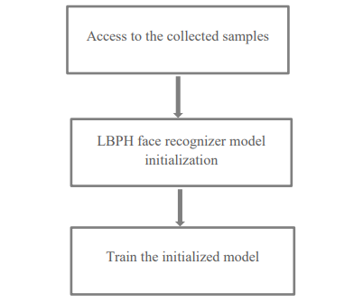
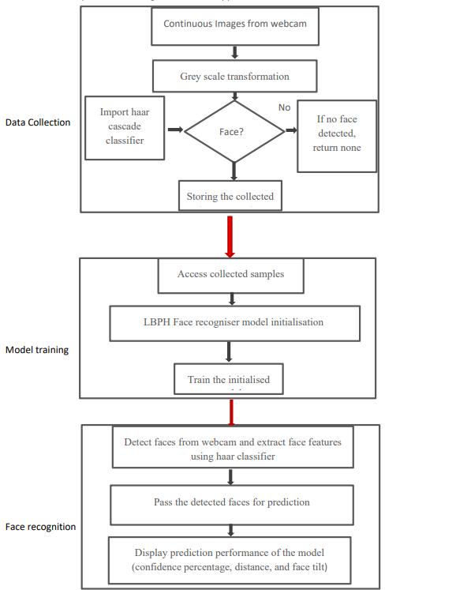

Methodology
===========

Implementation

The entire software has been implemented using OpenCV in the Python environment. This project can also be implemented in other languages like C++ because OpenCV is compatible with these languages as well. However, Python has been chosen for this project due to its:

1. Python bindings for OpenCV
2. Flexibility
3. Abundance of resources & strong open source community

3.1 Data Collection
-------------------

As discussed in the data collection flowchart’s explanation section, the overall workflow consists of two key steps:

- **Face Features Extraction**
- **Storage of Collected Data**

3.1.1 Face Features Extraction
------------------------------

This step is achieved through the face extraction method, which involves:

1. **Accessing the Webcam**:
   The webcam is accessed, and image frames are captured.

2. **Image Normalization**:
   - Normalization nullifies noise effects in the image.
   - Image transformations such as resizing and converting images from BGR to grayscale format are applied:
   - **Resizing**: Reduces the image size, focusing on face features.
   - **Grayscale Conversion**: Minimizes lighting variations, optimizing recognition.

3. **Face Detection**:
   - Pretrained Haar Cascade classifiers provided by OpenCV are used for face detection.
   - The `detectMultiScale` method detects objects of varying sizes and enables fine-tuning through parameters such as scale factor and min neighbors.

**Data Collection**:
Samples are collected, varying from a minimum of 20 to a maximum of 1000 for evaluation. If no face is detected, no sample is collected.

3.1.2 Storage of Collected Data
-------------------------------

- Detected face images are stored in a specified directory with sequential labels for easier access during model training.
- Along with face extraction, storage instructions are embedded in a loop to ensure valid detections are saved automatically.

3.2 System/Model Training
--------------------------

3.2.1 Overview of Model Training
--------------------------------

The training workflow involves:

1. **Accessing Collected Samples**:
   - Samples are accessed using the `os` library, enabling navigation to directories or files.

2. **Preparation of Data**:
   - Samples and their labels are stored in two separate lists, which are then converted into NumPy arrays.
   - NumPy facilitates model training by representing images as height, width, and channels.

3. **LBPH Face Recognizer Initialization**:
   - The model is initialized using `LBPHFaceRecognizer_create()`, generating histograms based on pixel occurrences.

4. **Training the Model**:
   - Training is conducted using the `model.train()` method with the prepared NumPy arrays.

Figure 2 explains the worflow of the model training phase as described above.

3.2.2 Face Recognition
----------------------

The trained model is tested with input images from the webcam. The process involves:

1. **Detection and Prediction**:
   - Faces are detected using Haar Cascade classifiers and passed to the `predict()` method.
   - The method returns confidence scores, which are converted into confidence percentages.

2. **Threshold Settings**:
   - The threshold value for confidence % is set at 75 by default, ensuring biometric authentication proceeds only if this value is exceeded.

3. **Additional Methods**:
   - Methods like `setThreshold()` and `getThreshold()` allow customization of threshold values.
   - Parameters like face grid dimensions (`setGridX()` and `setGridY()`) can also be modified.

3.2.3 Workflow Integration
--------------------------

The interdependencies among data collection, model training, and face recognition modules are illustrated in the overall system flowchart (Figure 3). The success of face recognition relies on proper training during the model training phase.

Figure 3: Flowchart displays the workflow integeration of the overall system/model.

3.3 Confidence Percentage Parameter Calculation
-----------------------------------------------

**Concept**:
Confidence % is inversely proportional to the confidence score returned by the `predict()` method. Using the complement rule of probability:

.. math::

   P(\text{not A}) = 1 - P(A)

Where \( P(A) \) is the probability of an event (having similarity) and \( P(\text{not A}) \) is its complement.

**Formula**:

.. math::

   \text{Confidence} \, \% = 100 \times (1 - \text{Confidence Score})

This calculation is key to determining the model’s accuracy during biometric authentication.
