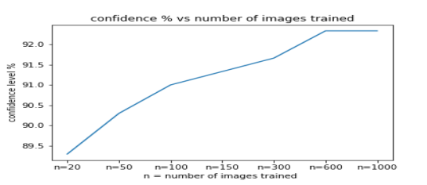
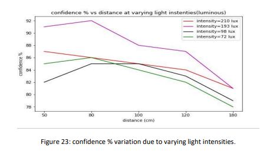
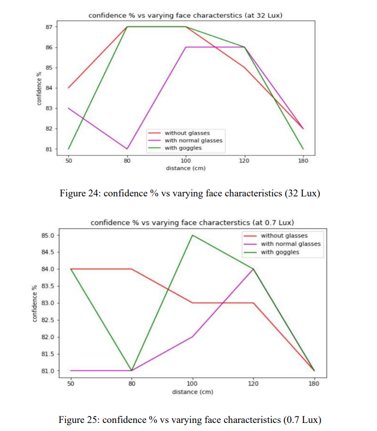

Results
=======

The model has been designed for biometric authentication using the LBPH Face recognition algorithm. To ensure commercial feasibility and successful operation, the model underwent evaluation under various critical conditions. This section outlines the test cases and results obtained.

**Hardware Used**:
- Dell G3 Laptop (8 GB RAM) with a webcam (Publisher: Microsoft, version: 2021.105.10.0).

**Software Tools**:
- Jupyter Notebook (Anaconda package), Python environment.

4.1 Test Case 1: Varying the Training Data
------------------------------------------

The purpose of this test case was to measure the model’s performance as the training data increased and to determine the reasonable amount of training data required for optimal performance. 

**Considerations**:
- Constant lighting conditions (daylight).
- Performance was analyzed for three positions (50 cm, 80 cm, 100 cm) aligned with the webcam’s line of sight. A single confidence % value was considered by averaging the three positions.
- Distance calculations were based on the focal length and face width using the formulas:

.. math::

   Fl = \frac{w2 \times d1}{w1}

.. math::

   d2 = \frac{w1 \times Fl}{w2}

**Output**:
Figure 5 illustrates the confidence % variation with training data. The results showed improvement in confidence % with increased training data, reaching saturation at approximately 92.33%.

   Figure 5: Confidence % variation with training data.

4.2 Test Case 2: Performance Analysis by Varying Distance
---------------------------------------------------------

The objective was to evaluate the maximum distance at which the model can confidently identify the user.

**Conditions**:
- Confidence % threshold: 75%
- Measurements taken along the line of sight with consistent lighting.

**Results**:
- The model successfully predicted confidence % above 75% up to 240 cm.

**Table 1**: Confidence % versus Distance

+---------------+--------------+
| Distance (cm) | Confidence % |
+===============+==============+
| 34            | 87           |
+---------------+--------------+
| 50            | 91           |
+---------------+--------------+
| 80            | 92           |
+---------------+--------------+
| 100           | 88           |
+---------------+--------------+
| 120           | 87           |
+---------------+--------------+
| 160           | 84           |
+---------------+--------------+
| 200           | 82           |
+---------------+--------------+
| 240           | 80           |
+---------------+--------------+

---

4.3 Test Case 3: Performance Analysis by Face Angle (Tilt) Variation
---------------------------------------------------------------------

This test case aimed to determine the maximum angle of face tilt for positive identification.

**Conditions**:
- Face tilt was measured using Haar Cascade for eye position and NumPy’s arctan method.

**Results**:
- The model successfully identified faces with a tilt of up to ±20°.

**Table 2**: Confidence % versus Face Tilt Angles

+-------------------+--------------+
| Direction, Angle  | Confidence % |
+===================+==============+
| L, 10             | 88           |
+-------------------+--------------+
| L, 12             | 86           |
+-------------------+--------------+
| L, 15             | 85           |
+-------------------+--------------+
| L, 18             | 84           |
+-------------------+--------------+
| C (Center)        | 90           |
+-------------------+--------------+
| R, 10             | 88           |
+-------------------+--------------+
| R, 12             | 85           |
+-------------------+--------------+
| R, 15             | 85           |
+-------------------+--------------+
| R, 18             | 84           |
+-------------------+--------------+

---

4.4 Test Case 4: Performance Analysis Under Different Lighting Conditions
-------------------------------------------------------------------------

This test case evaluated the model's performance under varying lighting conditions using light intensities measured in Lux.

**Conditions**:
- Positions: 50 cm, 80 cm, 100 cm, 120 cm, and 180 cm.
- Lighting intensities: 210 Lux, 193 Lux, 98 Lux, and 72 Lux.

**Results**:
- Performance was highest when light was focused on the face and decreased as the lighting became more diffused.
- Tables 3-6 summarize confidence % under different light intensities, visualized in Figure 23.

Table 3: Light intensity 210 Lux

+---------------+--------------+
| Position (cm) | Confidence % |
+===============+==============+
| 50            | 87           |
+---------------+--------------+
| 80            | 86           |
+---------------+--------------+
| 100           | 85           |
+---------------+--------------+
| 120           | 84           |
+---------------+--------------+
| 180           | 81           |
+---------------+--------------+

Table 4: Light intensity 193 Lux

+---------------+--------------+
| Position (cm) | Confidence % |
+===============+==============+
| 50            | 91           |
+---------------+--------------+
| 80            | 92           |
+---------------+--------------+
| 100           | 88           |
+---------------+--------------+
| 120           | 87           |
+---------------+--------------+
| 180           | 81           |
+---------------+--------------+

Table 5: Light intensity 98 Lux

+---------------+--------------+
| Position (cm) | Confidence % |
+===============+==============+
| 50            | 82           |
+---------------+--------------+
| 80            | 85           |
+---------------+--------------+
| 100           | 85           |
+---------------+--------------+
| 120           | 83           |
+---------------+--------------+
| 180           | 79           |
+---------------+--------------+

Table 6: Light intensity 72 Lux

+---------------+--------------+
| Position (cm) | Confidence % |
+===============+==============+
| 50            | 85           |
+---------------+--------------+
| 80            | 86           |
+---------------+--------------+
| 100           | 84           |
+---------------+--------------+
| 120           | 82           |
+---------------+--------------+
| 180           | 78           |
+---------------+--------------+

---

4.5 Test Case 5: Performance Analysis with Face Characteristic Variations
--------------------------------------------------------------------------

This test case analyzed model performance with different face appearances (normal face, glasses, goggles) under two lighting conditions (0.7 Lux and 32 Lux).

**Results**:
- The model performed better with goggles than with glasses due to reduced light reflections.
- Tables 7 and 8 provide confidence % values, visualized in Figures 24-25.

Table 7: Confidence % for light intensity 0.7 Lux

+---------------+-------------------+-------------------+-------------------+
| Distance (cm) | Confidence %      | Confidence %      | Confidence %      |
|               | (no glasses)      | (with glasses)    | (with goggles)    |
+===============+===================+===================+===================+
| 50            | 84                | 81                | 84                |
+---------------+-------------------+-------------------+-------------------+
| 80            | 84                | 81                | 81                |
+---------------+-------------------+-------------------+-------------------+
| 100           | 83                | 82                | 85                |
+---------------+-------------------+-------------------+-------------------+
| 120           | 83                | 84                | 84                |
+---------------+-------------------+-------------------+-------------------+
| 180           | 81                | 81                | 81                |
+---------------+-------------------+-------------------+-------------------+

Table 8: Confidence % for light intensity 32 Lux

+---------------+-------------------+-------------------+-------------------+
| Distance (cm) | Confidence %      | Confidence %      | Confidence %      |
|               | (no glasses)      | (with glasses)    | (with goggles)    |
+===============+===================+===================+===================+
| 50            | 84                | 83                | 81                |
+---------------+-------------------+-------------------+-------------------+
| 80            | 87                | 81                | 87                |
+---------------+-------------------+-------------------+-------------------+
| 100           | 87                | 86                | 87                |
+---------------+-------------------+-------------------+-------------------+
| 120           | 85                | 86                | 86                |
+---------------+-------------------+-------------------+-------------------+
| 180           | 82                | 82                | 8                 |
+---------------+-------------------+-------------------+-------------------+

---

4.6 Test Case 6: Performance Analysis for Unknown Users
--------------------------------------------------------

This test evaluated the model’s ability to identify users it was not trained on.

**Results**:
- The model recognized the unknown user with a precision of 40%, indicating a need for improvement in security and accuracy for unknown users.
